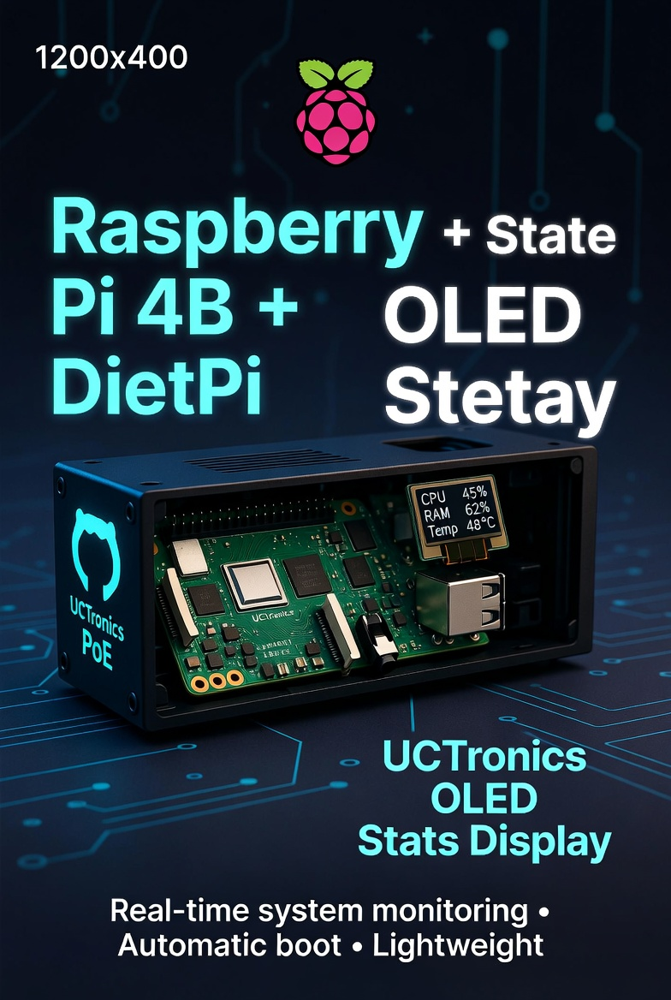
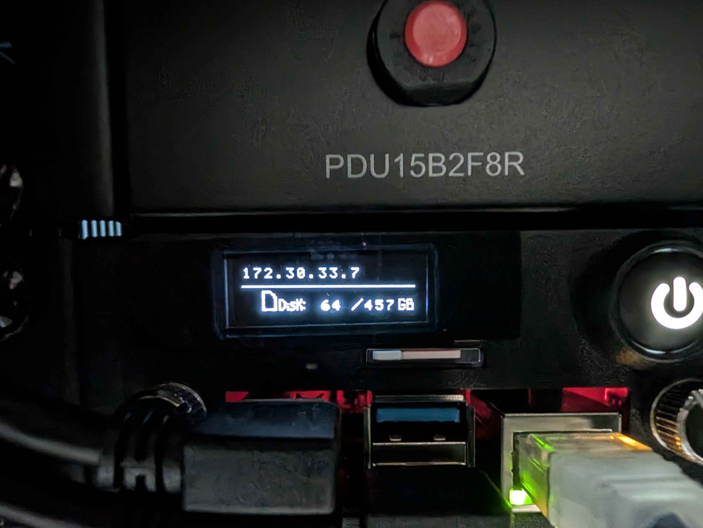

# Raspberry Pi 4B + DietPi + UCTronics OLED Stats Display



[](https://raspberrypi.com)
[](https://dietpi.com)
[](https://github.com/UCTRONICS/U6143_ssd1306)
[](https://opensource.org/licenses/MIT)
[](https://github.com/itsdukenguyen/rpi-dietpi-uctronics-oled)
[](https://www.raspberrypi.com/products/raspberry-pi-4-model-b/)

**A clean, lightweight, fully documented setup** for displaying real-time system stats (CPU, RAM, temperature, etc.) on the **UCTronics OLED** in a PoE Rack using **DietPi OS**.

**[One-Command Installer](setup.sh)** ← Recommended way

 <!-- Add your photo later -->

## ✨ Features
- One-command installer (`setup.sh`)
- Automatic startup via **DietPi Autostart**
- Minimal resource usage
- Fully tested on DietPi with Pi-Hole

## 📋 Hardware
- Raspberry Pi 4B
- UCTronics RPi Rack with PoE HAT
- UCTronics OLED display (SSD1306, 128x64, I2C)

## 🛠️ Step-by-Step Setup

### 1. Enable I2C
```bash
sudo dietpi-config
```

→ 7: Advanced Options → I2C State → Enabled → Reboot

Verify:
```bash
sudo i2cdetect -y 1
```

---

You should see `0x3C` (or similar).
### 2. Install Dependencies
```bash
sudo apt update
sudo apt install -y build-essential libi2c-dev i2c-tools git
```

---

### 3. Clone & Compile UCTronics Code
```bash
cd /home/dietpi
git clone https://github.com/UCTRONICS/U6143_ssd1306.git

cd U6143_ssd1306/C
sudo make clean && sudo make
```

Test manually:
```bash
sudo ./display
```

---

### 4. Configure DietPi Autostart (Recommended)
```bash
sudo dietpi-autostart
```

→ Choose 16: Custom Script

Create the script:
```bash
sudo nano /var/lib/dietpi/dietpi-autostart/custom.sh
```

Content of custom.sh:
```bash
#!/bin/bash
# UCTronics OLED Autostart for DietPi

cd /home/dietpi/U6143_ssd1306/C
sudo ./display &
```

Make executable:
```bash
sudo chmod +x /var/lib/dietpi/dietpi-autostart/custom.sh
```

Reboot and enjoy!

---

### 5. Cleanup (Minimal Footprint)
```bash
sudo apt remove --purge -y git build-essential
sudo apt autoremove -y
sudo apt autoclean

# Optional: Keep only the binary
cd /home/dietpi/U6143_ssd1306/C
sudo make clean
find . -type f ! -name 'display' -delete
```


Troubleshooting

- OLED blank → Check sudo i2cdetect -y 1
- I2C address wrong → Edit main.c and recompile
- Service logs: sudo journalctl -b | grep custom

---

## 📖 Full Documentation

| File | Description |
|------|-------------|
| [`setup.sh`](setup.sh) | One-command automated installer (Recommended) |
| [`custom.sh`](custom.sh) | DietPi autostart script |
| [`README.md`](README.md) | This document (full setup guide) |
| [`photos/oled-example.jpg`](photos/oled-example.jpg) | OLED display in action |

---

## 📁 Repository Structure

```text
rpi-dietpi-uctronics-oled/
├── README.md
├── setup.sh                    # One-command automated installer
├── custom.sh                   # Backup of DietPi autostart script
├── LICENSE
└── photos/                     # Place your OLED screenshots here
    └── oled-example.jpg
```

---

## 📸 Photos


🔗 References

- Official UCTronics Repo: https://github.com/UCTRONICS/U6143_ssd1306
- DietPi Forum & Docs

---

## 📄 License

[MIT License](LICENSE) © 2026 Duc Nguyen